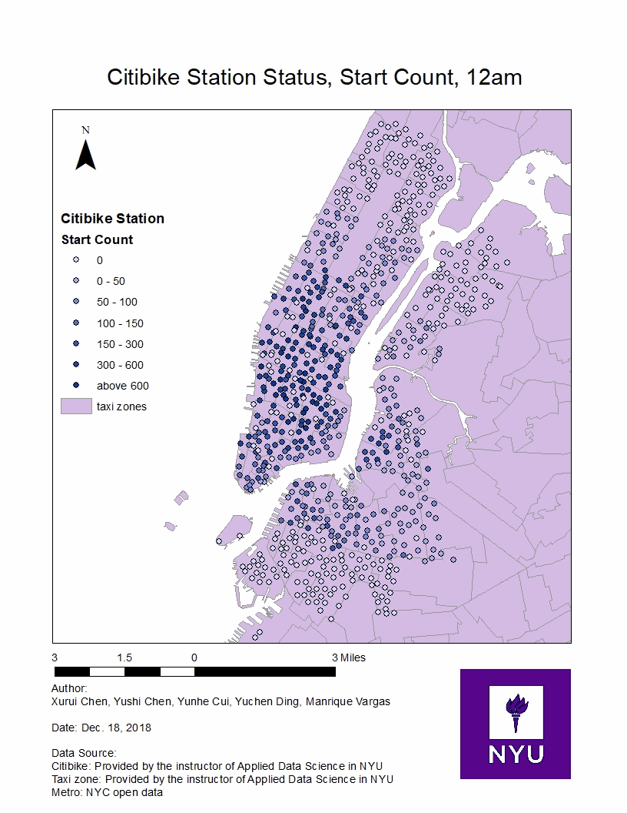

## FINAL DELIVERABLES

**Objective: Cluster the Citi Bike stations by using common features and find certain pattern. The result could be used for the future citibike  station prediction.**

1. Final_Paper (pdf):
[Citibike_ADS_Final_Paper](https://github.com/mv1742/CitiBike_Usage_Prediction_Model-1/blob/master/FINAL/Citibike_ADS.pdf)

2. Start Count - Visualization of Start Trips and Cluster Results

3. End Count

4. Empty Count - Visualization of Empty Stations in Manhattan

5. Source

[Citibike_ADS_Final_Paper](https://github.com/mv1742/CitiBike_Usage_Prediction_Model-1/blob/master/FINAL/GIS%20image%20and%20file%20for%20images.zip)
