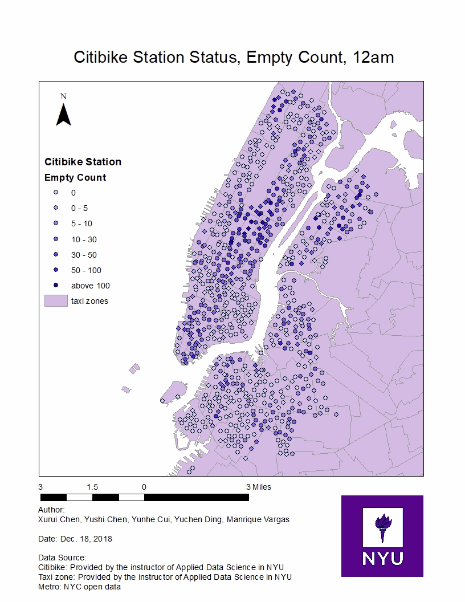
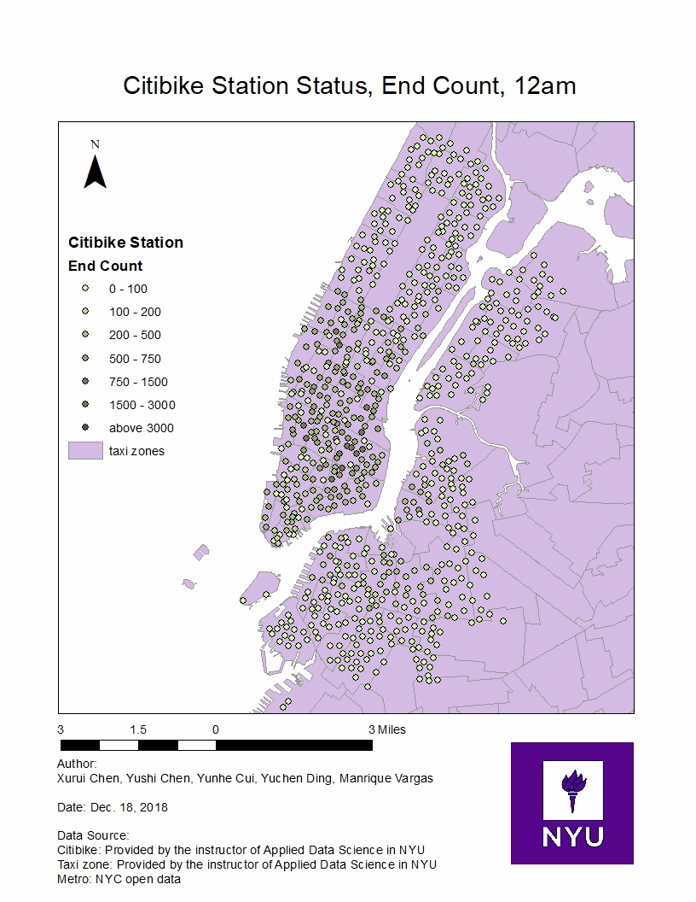
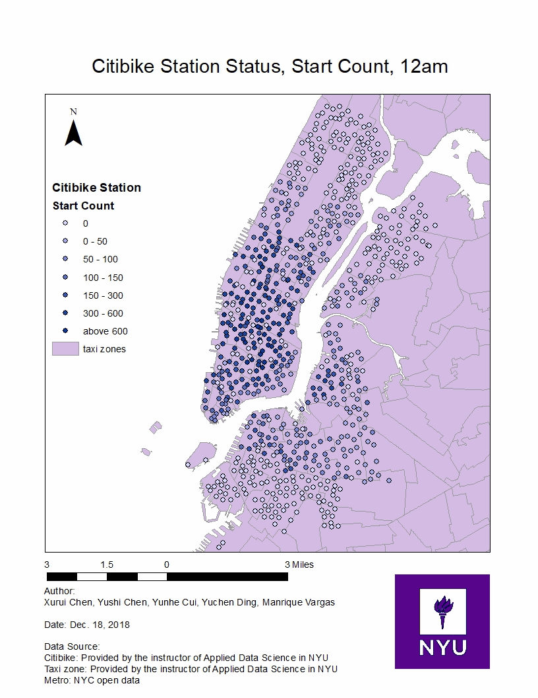

# CitiBike_Usage_Analysis

## Main Insights found

1. New Yorkers might realize that residential areas are busier in the morning and evening, while commerical areas are busier during midday.
1. It can be observed that some groups residential areas are empty in the morning and commercial areas are empty at night.

** Figue 1. Empty Stations During the 24 Hours of the Day

** Figue 2. Number of Ending Trips During the 24 Hours of the Day

** Figue 3. Number of Starting Trips During the 24 Hours of the Day

## Table of Contents

1. [Problem](README.md#Problem)
1. [Data Wrangling](README.md#Data Wrangling)
1. [Modeling](README.md#Modeling)
1. [Report](./Other/ADS_paper.pdf)
1. [Repo directory structure](README.md#Repo-directory-structure)
1. [Questions?](README.md#Questions?)

# Problem

Citibike has become an integral part of nyc's urban life, with different citibike stations having different needs from users. Therefore different types of sites will face different problems at different time times. There are nearly 1000 sites in nyc, and it is a very time-consuming and labor-intensive task to analyze and solve problems for each site. The Citibike system in New York City often has a bike imbalance: some stations are empty and others are full. This affects the quality of the service. Therefore, it is thought that clusters can be clustered and the problems of each type of site can be analyzed to solve the problem at a low cost.

## Data Wrangling
Here, using the citibike trip data for the whole year of 2015, the 12-month data is converted into a data set of 10 million data. In addition, we use another data set containing more than 800 citibike station information. According to the startime endtime and station_id of the trip data, the number of start and end trips of each station in the year is found for every hour. This way we have 48 eigenvalues ​​per site.

## Modeling

Choose 6 classes according to the elbow method. We perform K-means clustering based on the above 48 eigenvalues. This will allow to create a rebalancing strategy for the bike sharing operator.

The essential difference between different citibike sites is the number of bikes with start and end at each time period in 24 hours, so we perform clustering according to this feature. We also perform clustering using the empty stations along the 24 hours of the day. These vectors are independent and orthogonal which makes it suitable for K-means clustering.

## Other Analysis
Factors such as number of working and living population/gender/age are used to analyze the 24-hour start end number at different sites and the relationship between these factors. Found by the value of correlation, these factors have the greatest impact on which time period start and end.

## Repo directory structure

The directory structure looks like this:
    ├── README.md
    ├── Data
    ├── Clean_Data
    ├── Notebooks
    │   └── Real_time_empty.ipynb
    |   └── Stations_Clustering.ipynb
    ├── Visualizations
    ├── Other
        └── ADS_Paper.pdf
# Questions?
Email me at mv1742@nyu.edu
